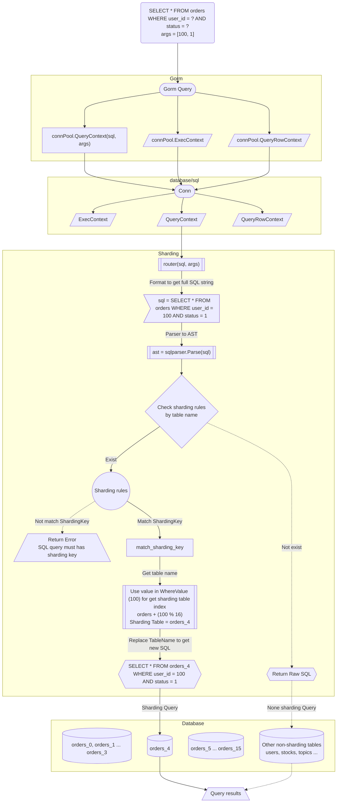

# Gorm Sharding

[](https://github.com/go-gorm/sharding/actions/workflows/tests.yml)

Gorm Sharding plugin using SQL parser and replace for splits large tables into smaller ones, redirects Query into sharding tables. Give you a high performance database access.

Gorm Sharding 是一个高性能的数据库分表中间件。

它基于 Conn 层做 SQL 拦截、AST 解析、分表路由、自增主键填充，带来的额外开销极小。对开发者友好、透明，使用上与普通 SQL、Gorm 查询无差别，只需要额外注意一下分表键条件。

## Features

- Non-intrusive design. Load the plugin, specify the config, and all done.
- Lighting-fast. No network based middlewares, as fast as Go.
- Multiple database (PostgreSQL, MySQL) support.
- Integrated primary key generator (Snowflake, PostgreSQL Sequence, Custom, ...).

## Install

```bash
go get -u gorm.io/sharding
```

## Usage

Config the sharding middleware, register the tables which you want to shard.

```go
import (
  "fmt"

  "gorm.io/driver/postgres"
  "gorm.io/gorm"
  "gorm.io/sharding"
)

db, err := gorm.Open(postgres.New(postgres.Config{DSN: "postgres://localhost:5432/sharding-db?sslmode=disable"))

db.Use(sharding.Register(sharding.Config{
    ShardingKey:         "user_id",
    NumberOfShards:      64,
    PrimaryKeyGenerator: sharding.PKSnowflake,
}, "orders", Notification{}, AuditLog{}))
// This case for show up give notifications, audit_logs table use same sharding rule.
```

Use the db session as usual. Just note that the query should have the `Sharding Key` when operate sharding tables.

```go
// Gorm create example, this will insert to orders_02
db.Create(&Order{UserID: 2})
// sql: INSERT INTO orders_2 ...

// Show have use Raw SQL to insert, this will insert into orders_03
db.Exec("INSERT INTO orders(user_id) VALUES(?)", int64(3))

// This will throw ErrMissingShardingKey error, because there not have sharding key presented.
db.Create(&Order{Amount: 10, ProductID: 100})
fmt.Println(err)

// Find, this will redirect query to orders_02
var orders []Order
db.Model(&Order{}).Where("user_id", int64(2)).Find(&orders)
fmt.Printf("%#v\n", orders)

// Raw SQL also supported
db.Raw("SELECT * FROM orders WHERE user_id = ?", int64(3)).Scan(&orders)
fmt.Printf("%#v\n", orders)

// This will throw ErrMissingShardingKey error, because WHERE conditions not included sharding key
err = db.Model(&Order{}).Where("product_id", "1").Find(&orders).Error
fmt.Println(err)

// Update and Delete are similar to create and query
db.Exec("UPDATE orders SET product_id = ? WHERE user_id = ?", 2, int64(3))
err = db.Exec("DELETE FROM orders WHERE product_id = 3").Error
fmt.Println(err) // ErrMissingShardingKey
```

The full example is [here](./examples/order.go).

> 🚨 NOTE: Gorm config `PrepareStmt: true` is not supported for now.
>
> 🚨 NOTE: Default snowflake generator in multiple nodes may result conflicted primary key, use your custom primary key generator, or regenerate a primary key when conflict occurs.

## Primary Key

When you sharding tables, you need consider how the primary key generate.

Recommend options:

- [Snowflake](https://github.com/bwmarrin/snowflake)
- [Database sequence by manully](https://www.postgresql.org/docs/current/sql-createsequence.html)

### Use Snowflake

Built-in Snowflake primary key generator.

```go
db.Use(sharding.Register(sharding.Config{
    ShardingKey:         "user_id",
    NumberOfShards:      64,
    PrimaryKeyGenerator: sharding.PKSnowflake,
}, "orders")
```

### Use PostgreSQL Sequence

There has built-in PostgreSQL sequence primary key implementation in Gorm Sharding, you just configure `PrimaryKeyGenerator: sharding.PKPGSequence` to use.

You don't need create sequence manually, Gorm Sharding check and create when the PostgreSQL sequence does not exists.

This sequence name followed `gorm_sharding_${table_name}_id_seq`, for example `orders` table, the sequence name is `gorm_sharding_orders_id_seq`.

```go
db.Use(sharding.Register(sharding.Config{
    ShardingKey:         "user_id",
    NumberOfShards:      64,
    PrimaryKeyGenerator: sharding.PKPGSequence,
}, "orders")
```

### No primary key

If your table doesn't have a primary key, or has a primary key that isn't called `id`, anyway, you don't want to auto-fill the `id` field, then you can set `PrimaryKeyGenerator` to `PKCustom` and have `PrimaryKeyGeneratorFn` return `0`.

## Combining with dbresolver

> 🚨 NOTE: Use dbresolver first.

```go
dsn := "host=localhost user=gorm password=gorm dbname=gorm port=5432 sslmode=disable"
dsnRead := "host=localhost user=gorm password=gorm dbname=gorm-slave port=5432 sslmode=disable"

conn := postgres.Open(dsn)
connRead := postgres.Open(dsnRead)

db, err := gorm.Open(conn, &gorm.Config{})
dbRead, err := gorm.Open(conn, &gorm.Config{})

db.Use(dbresolver.Register(dbresolver.Config{
  Replicas: []gorm.Dialector{dbRead.Dialector},
}))

db.Use(sharding.Register(sharding.Config{
  ShardingKey:         "user_id",
  NumberOfShards:      64,
  PrimaryKeyGenerator: sharding.PKSnowflake,
}))
```

## Sharding process

This graph show up how Gorm Sharding works.



## License

MIT license.

Original fork from [Longbridge](https://github.com/longbridgeapp/gorm-sharding).
